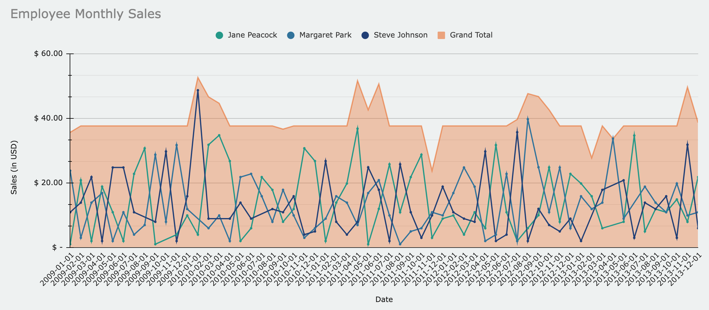
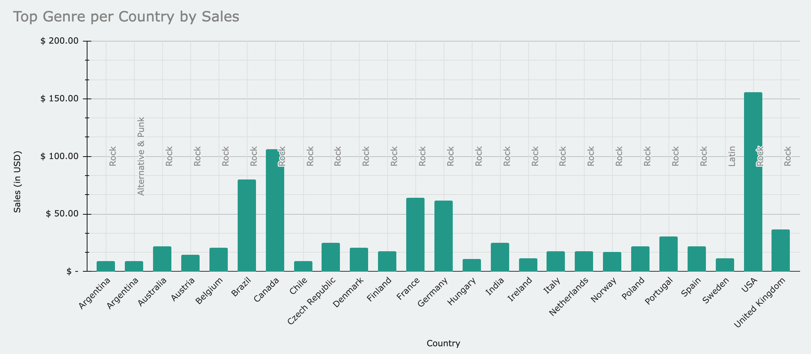

# SQL Project: Chinook Database

---

SQL Project for [Udacity's Business Analytics Nanodegree](https://www.udacity.com/enrollment/nd098-oneten-t2).

The Chinook Database holds information about a music store. For this project, you will be assisting the Chinook team with understanding the media in their store, their customers and employees, and their invoice information.

---
---

## Reporting

### Data Files

| Query | SQL | CSV | Excel |
| ----- | --- | --- | ----- |
| Query 1: Employee Monthly Sales | [query_1.sql](./data/sql/query_1.sql) | [query_1.csv](./data/csv/query_1.csv) | [sql_project.xlsx](./data/xlsx/sql_project.xlsx) |
| Query 2: Top Genre per Country by Sales | [query_2.sql:](./data/sql/query_2.sql) | [query_2.csv](./data/csv/query_2.csv) | [sql_project.xlsx](./data/xlsx/sql_project.xlsx) |
| Query 3: Rock Artists vs. Song Count | [query_3.sql](./data/sql/query_3.sql) | [query_3.csv](./data/csv/query_3.csv) | [sql_project.xlsx](./data/xlsx/sql_project.xlsx) |
| Query 4: Top Paying Customers per Country | [query_4.sql](./data/sql/query_4.sql) | [query_4.csv](./data/csv/query_4.csv) | [sql_project.xlsx](./data/xlsx/sql_project.xlsx) |

---

### Visualizations

#### Query 1: Employee Monthly Sales

> The following visualization displays employee sales over a period of four years. While each sales rep. experiences fluctuations in sales, the team is fairly consistent with their monthly grand total.
>
> 

---

#### Query 2: Top Genre per Country by Sales

> The following visualization highlights that Rock is the most popular genre in our database. The United States is our highest spender with sales over $150 on Rock music alone.
>
> 

---

#### Query 3: Rock Artists vs. Song Count

> The following visualization illustrates the number of songs for various rock artists. Led Zeppelin tops the list with the most songs (114), followed by U2 (112), Deep Purple (92), and Iron Maiden (81).
>
> 

---

#### Query 4: Top Paying Customers per Country

> The following visualization displays the top-paying customer from each country. The top spenders consistently fall between $35-$45.
>
> 

---
---

### Documents

- Queries File: [Queries.txt](./SQL_Project/Queries.txt)
- PDF Presentation: [Report.pdf](./SQL_Project/report.pdf)
- Spreadsheet
  - Google Sheets: [sql_project](https://docs.google.com/spreadsheets/d/1O7LMYjJiHAP39wgg7giwlFQwC9hul8NxzL2cPUjfw-4/edit?usp=sharing)
  - Microsoft Excel: [sql_project.xlsx](./data/xlsx/sql_project.xlsx)

---
---
---
